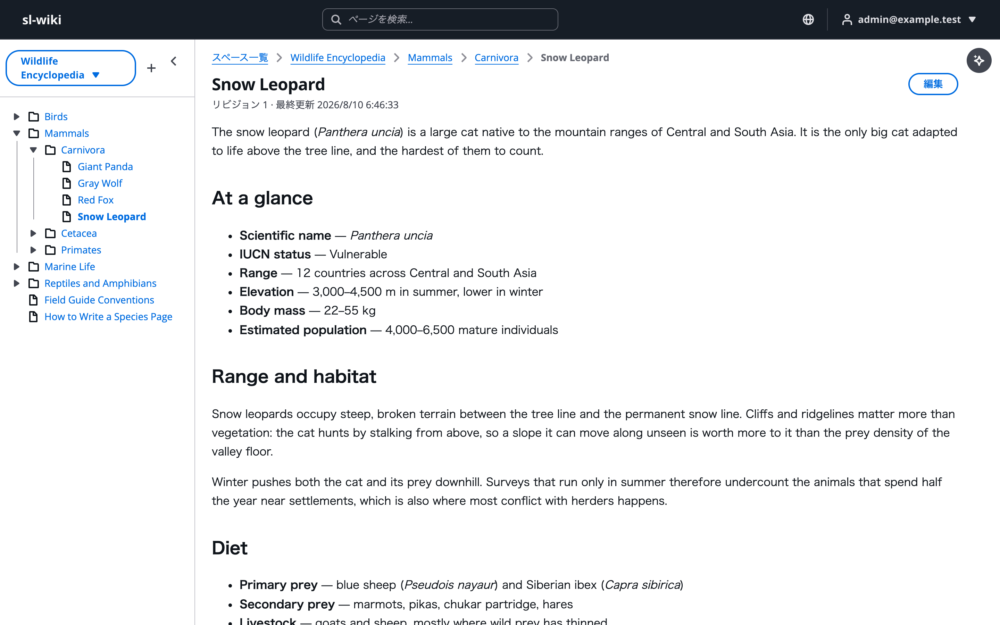
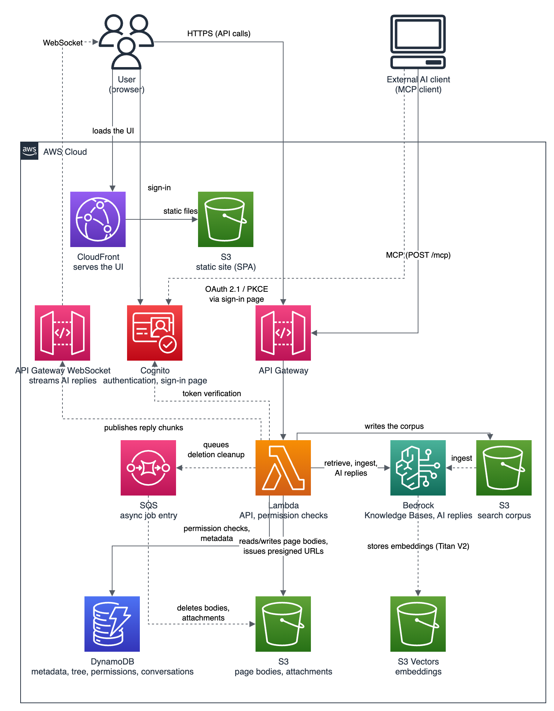
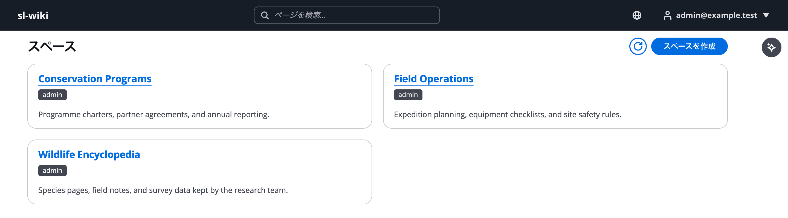
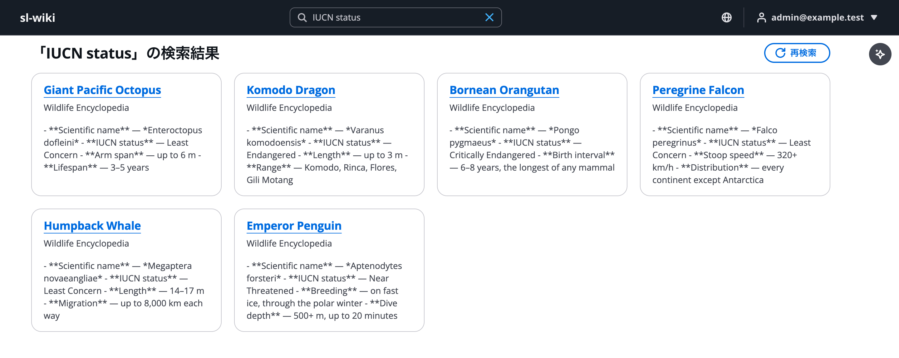
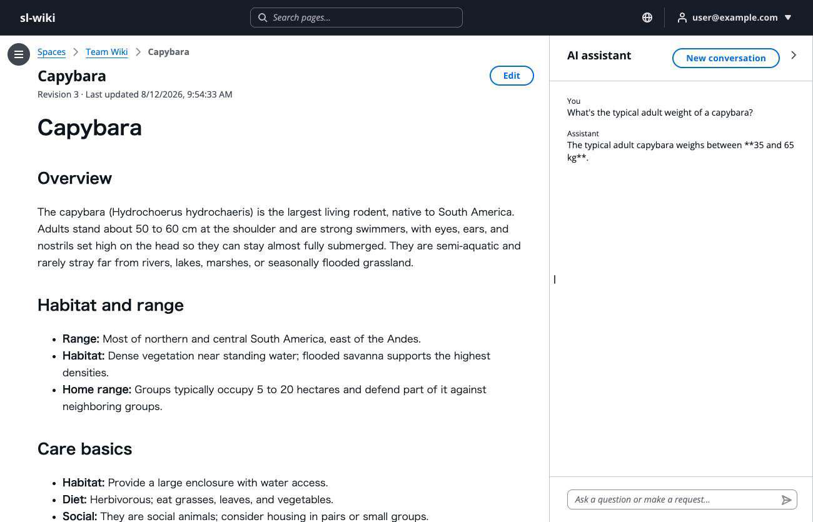
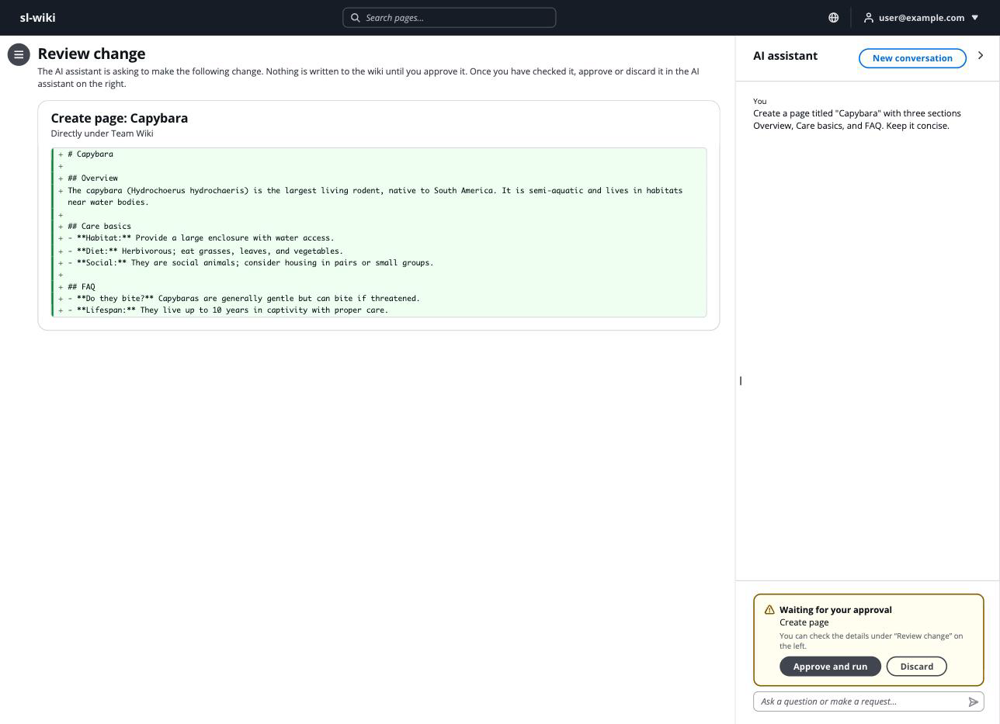
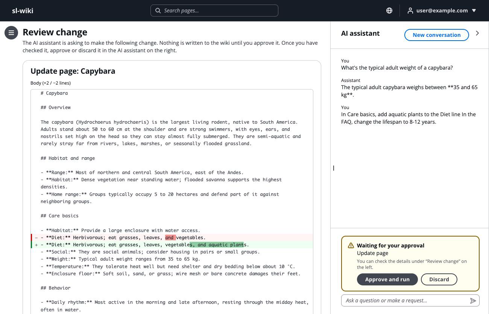

# serverless-wiki-on-aws

[](LICENSE)


[English](README.md) | **日本語**

運用者の AWS（Amazon Web Services）アカウントの中だけで動く Markdown の Wiki です。
AI エージェントが権限モデルの外へ出ないまま使えることを狙って作っています。
ブラウザーの画面、Amazon Bedrock の AI アシスタント、MCP（Model Context Protocol、AI クライアントとツールを接続する標準プロトコル）のクライアント、Obsidian（ローカルの Markdown ノートアプリ）の同期プラグインは、どれも同じページを読み書きし、API 層がリクエストごとに判定する同じスペース権限を通ります。
利用者が読めないスペースは、その利用者に代わって AI アシスタントが読むこともできません。

常時動かしておく EC2 インスタンス、コンテナ、データベースクラスタはありません。
デプロイするのは Lambda、API Gateway、DynamoDB、S3、CloudFront、Cognito、SQS、Bedrock です。



*ページを読んでいるところです。載せているページは説明用のサンプルです。*

## 機能

- Markdown のページを、スペースごとのフォルダーとページの木構造で整理します
- スペース単位の権限を、API 層がリクエストごとに判定します。画面、AI アシスタント、MCP サーバー、同期用 API のすべてが同じ判定を通ります
- サインインは Cognito のメールアドレスで、すべてのアカウントに TOTP（Time-based One-Time Password、認証アプリが出す時限式のワンタイムパスワード）の MFA（多要素認証）を必須にします。サインアップは塞いであり、運用者がアカウントを作ります。自分の権限を上げる API はありません
- Amazon Bedrock の AI アシスタントが Wiki を検索し、見つけた内容から答え、利用者が承認したときだけページを書き換えます。既定で答えるモデルは Amazon Nova 2 Lite で、環境変数 `AI_MODEL_ID` が別の Bedrock のモデルに差し替えます
- 検索窓は 1 つで、2 通りの検索を融合します。スペースごとの転置インデックス（語からその語を含む文書の一覧を引く索引）を BM25（語の珍しさと出現回数から重要度を出す式）で順位付けして完全一致の語や識別子を引き、Bedrock Knowledge Bases と S3 Vectors（ベクトル検索用のストレージ）と Titan Text Embeddings V2 が意味の近いページを引き、両方の順位を RRF（Reciprocal Rank Fusion、順位の逆数を足し合わせて 1 つに融合する手法）で並べ直します。結果にはヒット箇所の抜粋が付き、打鍵の途中ではサジェストが出ます
- `POST /mcp` の MCP サーバーが、Cognito を認可サーバーとする OAuth 2.1 の認証で、Claude などの MCP クライアントに応えます
- Obsidian の保管庫とスペースを双方向に同期するプラグインを同梱しています
- 添付ファイルは presigned URL（署名付き URL、短時間だけ有効なリンク）で配信します。バケットはパブリックアクセスを全面ブロックします
- 画面はヘッダーで日本語と英語を切り替えられます
- インフラは [AWS Blocks](https://www.npmjs.com/package/@aws-blocks/blocks)（Infrastructure-from-Code のフレームワーク）で定義します

## 構成図



*実線の矢印は同期のリクエスト経路を、破線の矢印は非同期・背景の流れを表します。図の元データは [assets/architecture.drawio](assets/architecture.drawio) にあります（図中の文言は英語です）。*

## 画面



*スペースの一覧です。カードのバッジは、サインイン中のアカウントがそのスペースに持つ権限を表します。読めないスペースはこの一覧に出ません。*



*検索の結果です。返す前に、Wiki が同じスペース権限で絞り込みます。*



*AI アシスタントです。Wiki を検索し、サインイン中のアカウントが読めるページから答えます。*



*AI アシスタントにページの作成を頼んだところです。利用者が承認するまで、AI アシスタントは Wiki に書き込みません。*



*既存ページの編集は、承認の前に差分で確かめられます。*

## 前提

- [Node.js 24](https://nodejs.org/) と [pnpm 11](https://pnpm.io/)（npm は使いません。`mise install` が `mise.toml` から両方を入れます）
- デプロイする場合は、AWS アカウント、[AWS CLI 2.32.0 以上](https://docs.aws.amazon.com/cli/latest/userguide/getting-started-install.html)、Amazon Nova 2 Lite と Titan Text Embeddings V2 に対する Bedrock のモデルアクセス
- CDK が作る CloudFormation のスタックは、AWS CLI のプロファイルが指すリージョンへ入ります。動かして確かめてあるのは `ap-northeast-1`（東京）です。どのリージョンを選ぶ場合も、S3 Vectors と上の 2 つの Bedrock のモデルが使えることが要ります

## すぐ試す

AWS アカウントは要りません。
すべての Building Block が手元でモックとして動き、モックのデータは `.bb-data/` に置かれます。

```bash
pnpm install
pnpm run dev
```

**ブラウザで開く：**[http://localhost:3000](http://localhost:3000)

モックはサインアップを受け付けるので、その画面でアカウントを作ってサインインします。
ただし権限はモックになっていません。
作ったばかりのアカウントはどのグループにも属さないため、スペースが 1 つも見えません。
デプロイ後と同じ手順で自分を管理者にします。
ローカルの保管先はサーバーが書き換えるファイルなので、先にサーバーを止めます。

```bash
# 開発サーバーを Ctrl-C で止めてから
pnpm run seed-admin -- --local --email you@example.test
pnpm run dev
```

手元で動かないものが 1 つあります。
AI アシスタントは模擬モデルにつながっており、決まった文面を返すだけなので、確かめられるのは一連の流れだけです。
ページ、権限、検索、添付ファイルは、デプロイした環境と同じように動きます。

## AWS へデプロイする

```bash
aws login --profile <プロファイル名>
pnpm run deploy   # 初回だけ 2 回実行します
```

CloudFront の配信オリジンは 1 回目のデプロイが作るので、その 1 回目が Lambda に設定を渡す時点では、まだアドレスが存在しません。
2 回目の実行がスタックの出力からアドレスを読んで渡します。
以降は 1 回で足ります。

### 最初のアカウントを作る

サインアップを塞いでいるため、デプロイ直後はサインインできる利用者が 1 人もいません。
運用者が Cognito のユーザープールに最初のアカウントを作ります。
パスワードは 12 文字以上で、大文字・小文字・数字・記号を各 1 つ以上含む必要があります。

```bash
# 名前がスタック ID で始まるプールが対象
aws cognito-idp list-user-pools --max-results 10 --profile <プロファイル名> --region <リージョン>

aws cognito-idp admin-create-user \
  --user-pool-id <ユーザープール ID> \
  --username you@example.com \
  --user-attributes Name=email,Value=you@example.com Name=email_verified,Value=true \
  --message-action SUPPRESS \
  --profile <プロファイル名> --region <リージョン>

# パスワードを恒久設定する（初回サインインをパスワード変更の要求にしないため）
aws cognito-idp admin-set-user-password \
  --user-pool-id <ユーザープール ID> \
  --username you@example.com \
  --password '<パスワード>' \
  --permanent \
  --profile <プロファイル名> --region <リージョン>
```

ユーザープールは MFA を必須にしており、要素は TOTP だけです。
そのため、運用者がブラウザーで最初にサインインすると、認証アプリの登録画面が出ます。
運用者は表示された QR コードを認証アプリで読み取り、そのアプリが出す 6 桁のコードを入力します。
2 回目以降のサインインは、コードの入力だけを求めます。

### 最初の管理者を作る

運用者はブラウザで一度サインインします。
このサインインが利用者のプロフィールを書き、次の手順が指す Cognito の `sub`（利用者の識別子）を決めるので、先に済ませます。
続いて権限テーブル（名前はスタック ID で始まり `-permissions` で終わります）を調べ、自分を管理者として投入します。

```bash
aws dynamodb list-tables --profile <プロファイル名> --region <リージョン>
AWS_PROFILE=<プロファイル名> pnpm run seed-admin -- --table <テーブル名> --email you@example.com
```

自分の権限を上げる API を Wiki が持たないため、この手順はスクリプトであってボタンではありません。
2 人目以降の管理者は、最初の管理者が管理画面から追加します。

### sandbox

`pnpm run sandbox` は、バックエンドを AWS に置き、フロントエンドを手元で動かします。
オリジンは自動で解決しないので、運用者が渡します。

```bash
CORS_ALLOWED_ORIGINS=http://localhost:3000 pnpm run sandbox
```

### 撤去する

```bash
pnpm run sandbox:destroy   # sandbox のスタックを、データごと消します
pnpm run destroy           # デプロイしたスタックを消します
```

sandbox は使い捨てなので、テーブルもバケットもスタックと一緒に消えます。
本番のデプロイは違います。
DynamoDB のテーブル、本文と添付のバケット、検索コーパスのバケットは意図的に残す設定にしてあるため、`pnpm run destroy` はこれらを残します。
保管の料金も残るので、運用者が自分の判断で削除します。

## 設定

| 環境変数 | 既定 | 役割 |
|---|---|---|
| `CORS_ALLOWED_ORIGINS` | `pnpm run deploy` がスタックの出力から読みます | S3 のバケットが presigned URL の要求を受け付けるオリジンの一覧（カンマ区切り）です。一致するものが無いと、ブラウザからの添付ファイルの操作が失敗します。CloudFront の前にカスタムドメインを立てているときと、配信オリジンが複数あるときは、運用者が明示的に渡します。ワイルドカードは受け付けません |
| `MCP_PUBLIC_ORIGIN` | `pnpm run deploy` がスタックの出力から読みます | MCP の OAuth メタデータが公示するオリジンです。カスタムドメインのときは運用者が明示的に渡します |
| `AI_MODEL_ID` | `global.amazon.nova-2-lite-v1:0` | AI アシスタントが呼ぶ Bedrock のモデルです。既定は Amazon Nova 2 Lite の Global 推論プロファイル（リクエストを対応リージョンへ振り分ける定義）です。`jp.amazon.nova-2-lite-v1:0` は推論を日本国内に閉じ、`global.anthropic.claude-sonnet-4-6` と `global.anthropic.claude-sonnet-5` はツール選択の精度が上がり料金も上がります。どれを指定する場合も、運用者が Bedrock でそのモデルのアクセスを先に有効にします（この環境変数はアクセス権を与えません）。読むのは実行時なので、未設定や空文字はエラーにならず既定に落ちます |

### MCP クライアントに登録する

`.mcp.json.example` を `.mcp.json` に写し、CloudFront のドメインと、スタック出力 `McpClientId` の値を埋めます。

```bash
aws cloudformation describe-stacks --stack-name <スタック名> --profile <プロファイル名> \
  --query 'Stacks[0].Outputs[?OutputKey==`McpClientId`].OutputValue' --output text
```

### Obsidian と同期する

同梱のプラグイン `clients/obsidian/` が、Obsidian の保管庫と、利用者が読めるスペースを同期します。
食い違ったときは Wiki を正とし、プラグインが手元の版を退避してから Wiki の版で上書きします。
導入と利用の手順は [clients/obsidian/README.ja.md](clients/obsidian/README.ja.md) にあります。

## ディレクトリ構成

```
serverless-wiki-on-aws/
├── aws-blocks/           # バックエンド
│   ├── index.cdk.ts      # CDK アプリ（Building Block の宣言は resources.ts）
│   ├── index.ts          # フロントエンドが呼ぶ API
│   ├── access.ts         # 権限判定
│   ├── wiki-ops.ts       # ページ、ツリー、検索の操作
│   ├── keyword-index.ts  # 転置インデックスの構築、検索、サジェスト
│   ├── mcp.ts            # MCP サーバー（POST /mcp）
│   ├── ext.ts            # 同期クライアント向け API（POST /ext/*）
│   └── scripts/          # deploy、sandbox、seed-admin、destroy
├── src/                  # フロントエンド（React 19 + Vite + Cloudscape）
│   ├── app/              # ルーティング、プロバイダー、画面の外枠
│   ├── features/         # spaces、pages、search、assistant、auth、admin
│   ├── components/       # feature をまたいで使う UI 部品
│   └── lib/              # Markdown、差分、ルーター、TanStack Query、日英の辞書
├── clients/obsidian/     # Obsidian 同期プラグイン
├── test/                 # API 全体を通す E2E テストと、単体テスト
├── assets/               # この文書に載せる画面の画像と構成図
└── README.md             # 英語版のこの文書
```

## 制約

- **検索は保存に少し遅れます。** 2 つの索引はどちらも 30 秒の待ち合わせを置いたジョブが作り直し、意味検索の側はそこからコーパス全体を読み直すため、書いたばかりのページはすぐには検索に出ません。
- **日本語の索引は 2 文字ずつの bigram です。** 形態素解析器（辞書を持ち文を単語に分ける解析器）を Lambda に載せていないため、キーワード検索がまれに、同じ 2 文字の並びがたまたま揃っただけのページを拾います。
- **本文の中の生の HTML は描画しません。** Markdown は CommonMark（Markdown の標準仕様）に GFM（GitHub Flavored Markdown、GitHub 方言）の表・タスクリスト・取り消し線を足した範囲を描画し、改行 1 つも改行として扱いますが、本文が書いた HTML のタグは解釈せず文字のまま出します。画像として埋め込むのはそのページ自身の添付だけで、それ以外の画像はリンクとして描くため、ページを開いても外部のホストへ取りに行きません。検索結果の抜粋は平文で表示するため、そこに含まれる Markdown の記法は記号のまま見えます。
- **最初の 1 人を入れるまでに CLI の操作が要ります。** デプロイ直後の運用者は、`pnpm run deploy` を 2 回実行し、AWS CLI で Cognito にアカウントを作り、一度サインインしてから `pnpm run seed-admin` を実行します。自分の権限を上げる API を Wiki が持たないため、最後の手順はスクリプトです。
- **監査ログと呼び出し頻度の制限はありません。**

## 参考

- [AWS Blocks](https://www.npmjs.com/package/@aws-blocks/blocks)：このプロジェクトの実装基盤
- [Amazon Bedrock Knowledge Bases](https://docs.aws.amazon.com/bedrock/latest/userguide/knowledge-base.html)：意味検索の基盤
- [Model Context Protocol](https://modelcontextprotocol.io/)：`/mcp` が話すプロトコル
- [Cloudscape Design System](https://cloudscape.design/)：画面の部品体系

## ライセンス

[MIT License](LICENSE)
