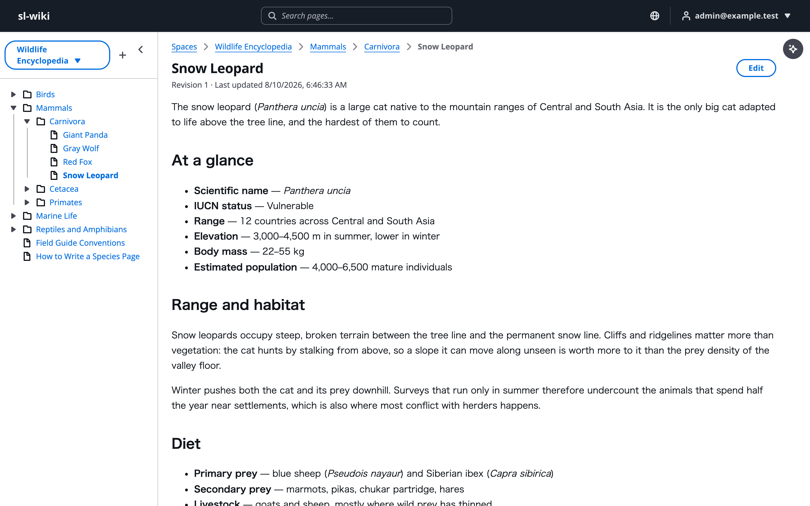
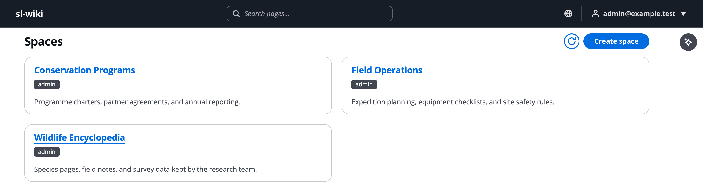
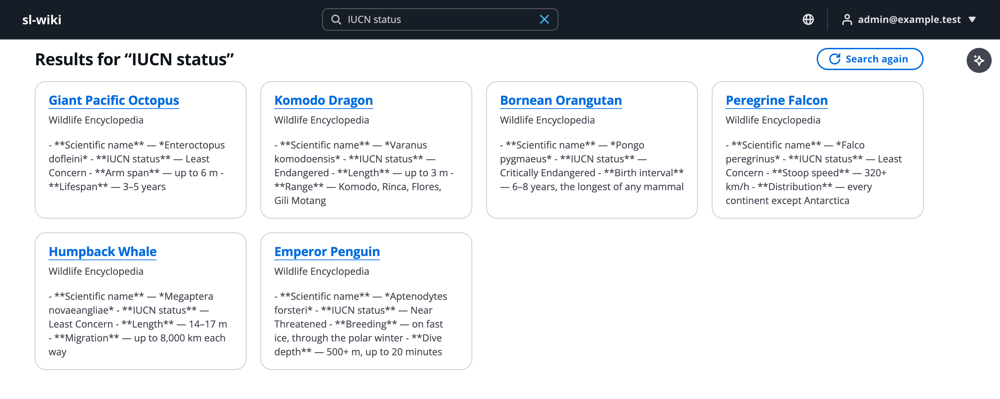

# serverless-wiki-on-aws

[](LICENSE)


**English** | [日本語](README.ja.md)

A Markdown wiki that runs entirely in your own AWS account, built so that AI agents can use it without stepping outside its permission model. The browser UI, the Amazon Bedrock assistant, MCP clients, and the Obsidian sync plugin read and write the same pages through the same space permission check, resolved in the API layer on every request. A space you cannot read is a space the assistant cannot read on your behalf.

Nothing stays running: there are no EC2 instances, containers, or database clusters. The deployed stack is Lambda, API Gateway, DynamoDB, S3, CloudFront, Cognito, SQS, and Bedrock.



*Reading a page. The pages shown here are sample content.*

## Features

- Markdown pages arranged in a folder-and-page tree, one tree per space
- Space-level permissions resolved on every request in the API layer — the UI, the AI assistant, the MCP server, and the sync API all pass the same check
- Sign-in is a Cognito email address, and TOTP multi-factor authentication is required of every account. Sign-up is closed: an operator creates accounts, and no API raises anyone's own permissions
- AI assistant on Amazon Bedrock: it searches the wiki, answers from what it finds, and edits pages only after you approve the change. Amazon Nova 2 Lite answers by default; `AI_MODEL_ID` swaps in another Bedrock model
- Hybrid search in one box: an inverted index per space, ranked with BM25, finds exact keywords and identifiers; Bedrock Knowledge Bases with S3 Vectors and Titan Text Embeddings V2 finds meaning; the two rankings are fused with Reciprocal Rank Fusion. Results carry a highlighted excerpt, and suggestions appear as you type
- MCP (Model Context Protocol) server at `POST /mcp`, authenticated with OAuth 2.1 through Cognito, for Claude and other MCP clients
- Obsidian plugin that syncs a vault and a space in both directions
- Attachments delivered through presigned URLs; the bucket blocks all public access
- Japanese and English UI, switched in the header
- Infrastructure defined with [AWS Blocks](https://www.npmjs.com/package/@aws-blocks/blocks), an Infrastructure-from-Code framework

## Architecture


*Solid arrows are the request path; dashed arrows are asynchronous or background flows. The diagram source is [assets/architecture.drawio](assets/architecture.drawio).*

## Screens



*The space list. The badge on each card is the permission the signed-in account holds on that space — a space you cannot read never appears here.*



*Search. Results are filtered by the same space permissions before they are returned.*


*The AI assistant. It searches the wiki and answers from the pages the signed-in account can read.*


*Asking the assistant to create a page. Nothing is written to the wiki until you approve the change.*


*An edit to an existing page appears as a diff before approval.*

## Prerequisites

- [Node.js 24](https://nodejs.org/) and [pnpm 11](https://pnpm.io/) (npm is not supported; `mise install` picks up both from `mise.toml`)
- To deploy: an AWS account, [AWS CLI 2.32.0+](https://docs.aws.amazon.com/cli/latest/userguide/getting-started-install.html), and Bedrock model access for Amazon Nova 2 Lite and Titan Text Embeddings V2
- The CloudFormation stack CDK builds goes to whichever region your AWS profile names. It has been run against `ap-northeast-1` (Tokyo); any region you pick has to offer S3 Vectors and the two Bedrock models above

## Quick Start

No AWS account is needed. Every Building Block runs mocked on your machine, and the mock data lands in `.bb-data/`.

```bash
pnpm install
pnpm run dev
```

**Open your browser:** Navigate to [http://localhost:3000](http://localhost:3000).

Sign-up is open against the local mock, so create an account there and sign in. Permissions are not mocked, though: a brand-new account belongs to no group and therefore sees no spaces. Make yourself an administrator the same way a real deployment does — the local store is a file the running server rewrites, so stop it first.

```bash
# Ctrl-C the dev server, then
pnpm run seed-admin -- --local --email you@example.test
pnpm run dev
```

One thing does not run locally: the assistant talks to a mock model that replies with fixed text, so the conversation is only good for exercising the flow. Everything else — pages, permissions, search, attachments — behaves like the deployed system.

## Deploy to AWS

```bash
aws login --profile <profile>
pnpm run deploy   # on the very first deploy, run this twice
```

The first run creates the CloudFront distribution, so its address does not exist yet while that same run is configuring the Lambda. The second run reads the address from the stack output and passes it in. After that, one run per deploy is enough.

### The first account

Sign-up is closed, so a fresh deployment has nobody who can sign in. Create the first account yourself in the Cognito user pool. The password has to be 12 characters or longer and carry an upper-case letter, a lower-case letter, a digit, and a symbol.

```bash
# The pool whose name starts with your stack id
aws cognito-idp list-user-pools --max-results 10 --profile <profile> --region <region>

aws cognito-idp admin-create-user \
  --user-pool-id <user-pool-id> \
  --username you@example.com \
  --user-attributes Name=email,Value=you@example.com Name=email_verified,Value=true \
  --message-action SUPPRESS \
  --profile <profile> --region <region>

# Set the password permanently, so the first sign-in is not a password-change challenge
aws cognito-idp admin-set-user-password \
  --user-pool-id <user-pool-id> \
  --username you@example.com \
  --password '<password>' \
  --permanent \
  --profile <profile> --region <region>
```

The pool requires MFA and offers TOTP as the only factor, so the first sign-in in the browser presents an enrolment challenge: scan the QR code with an authenticator app and enter the six-digit code it shows. Every later sign-in asks for a code.

### The first administrator

Sign in once in the browser. That sign-in writes your profile record and fixes the Cognito `sub` the next step points at, so it has to come first. Then find the permission table — its name starts with the stack id and ends in `-permissions` — and seed yourself.

```bash
aws dynamodb list-tables --profile <profile> --region <region>
AWS_PROFILE=<profile> pnpm run seed-admin -- --table <table-name> --email you@example.com
```

Nothing in the API raises anyone's own permissions, which is why this step is a script and not a button. Every administrator after the first one is added by an administrator, from the admin screens.

### Sandbox

`pnpm run sandbox` puts the backend on AWS and leaves the frontend on your machine. It does not resolve the origin for you, so name it yourself.

```bash
CORS_ALLOWED_ORIGINS=http://localhost:3000 pnpm run sandbox
```

### Teardown

```bash
pnpm run sandbox:destroy   # the sandbox stack, data and all
pnpm run destroy           # the deployed stack
```

A sandbox is disposable: its tables and buckets are destroyed with it. A real deployment is not. The DynamoDB table, the content bucket, and the search corpus bucket are retained on purpose, so `pnpm run destroy` leaves them — and their storage charges — behind for you to delete deliberately.

## Configuration

| Variable | Default | Purpose |
|---|---|---|
| `CORS_ALLOWED_ORIGINS` | read from the stack output by `pnpm run deploy` | Comma-separated origins the S3 bucket accepts presigned-URL requests from. Without a match, attachments fail in the browser. Set it explicitly when a custom domain sits in front of CloudFront or several origins serve the app. Wildcards are rejected. |
| `MCP_PUBLIC_ORIGIN` | read from the stack output by `pnpm run deploy` | The origin the MCP OAuth metadata advertises. Set it explicitly for a custom domain. |
| `AI_MODEL_ID` | `global.amazon.nova-2-lite-v1:0` | The Bedrock model the assistant talks to. Amazon Nova 2 Lite through its Global inference profile is the default. `jp.amazon.nova-2-lite-v1:0` keeps inference inside Japan; `global.anthropic.claude-sonnet-4-6` and `global.anthropic.claude-sonnet-5` select tools better and cost more. Whichever you name, enable model access for it in Bedrock first — passing the variable does not grant it. Read at run time, so an unset or empty value lands on the default rather than failing. |

### MCP clients

Copy `.mcp.json.example` to `.mcp.json` and fill in the CloudFront domain and the `McpClientId` stack output.

```bash
aws cloudformation describe-stacks --stack-name <stack-name> --profile <profile> \
  --query 'Stacks[0].Outputs[?OutputKey==`McpClientId`].OutputValue' --output text
```

### Obsidian sync

The bundled plugin in `clients/obsidian/` syncs an Obsidian vault with the spaces you can read. When the two sides disagree, the wiki wins: the plugin sets your local copy aside and writes the wiki's version over it. Setup and usage are in [clients/obsidian/README.md](clients/obsidian/README.md).

## Project Structure

```
serverless-wiki-on-aws/
├── aws-blocks/           # Backend
│   ├── index.cdk.ts      # CDK app; resources.ts declares the Building Blocks
│   ├── index.ts          # API surface the frontend calls
│   ├── access.ts         # Permission resolution
│   ├── wiki-ops.ts       # Page, tree, and search operations
│   ├── keyword-index.ts  # Inverted index: rebuild, search, suggest
│   ├── mcp.ts            # MCP server (POST /mcp)
│   ├── ext.ts            # Sync-client API (POST /ext/*)
│   └── scripts/          # deploy, sandbox, seed-admin, destroy
├── src/                  # Frontend (React 19 + Vite + Cloudscape)
│   ├── app/              # Routes, providers, and the app shell
│   ├── features/         # spaces, pages, search, assistant, auth, admin
│   ├── components/       # UI shared across features
│   └── lib/              # Markdown, diff, router, TanStack Query, i18n dictionaries
├── clients/obsidian/     # Obsidian sync plugin
├── test/                 # End-to-end test across the whole API, and unit tests
├── assets/               # Screenshots and the architecture diagram used by this README
└── README.md             # This file
```

## Limitations

- **Search lags a save.** Both indexes are rebuilt by a job debounced by 30 seconds, and re-ingestion then re-reads the whole corpus, so a page you just wrote takes a moment to become findable.
- **Japanese is indexed as bigrams.** No morphological analyzer ships in the Lambda, so a keyword query occasionally matches a page where the same character pairs merely happen to line up.
- **Raw HTML in a body is not rendered.** Markdown is CommonMark plus GFM — tables, task lists, strikethrough — and a single newline is a line break, but a body's own HTML tags are shown as text rather than parsed. A page embeds only its own attachments as images; every other image target renders as a link, so opening a page never calls out to another host. Search excerpts are still plain text, so any Markdown in them appears as written.
- **Getting the first person in takes the CLI.** A fresh deployment needs `pnpm run deploy` twice, an account created in Cognito with the AWS CLI, one sign-in, and then `pnpm run seed-admin`. Nothing in the API raises anyone's own permissions, which is why the last step is a script.
- **No audit log or request rate limiting.**

## Learn More

- [AWS Blocks](https://www.npmjs.com/package/@aws-blocks/blocks) — the Infrastructure-from-Code framework this project is built on
- [Amazon Bedrock Knowledge Bases](https://docs.aws.amazon.com/bedrock/latest/userguide/knowledge-base.html) — the semantic search backend
- [Model Context Protocol](https://modelcontextprotocol.io/) — the protocol the `/mcp` endpoint speaks
- [Cloudscape Design System](https://cloudscape.design/) — the UI components

## License

[MIT License](LICENSE)
